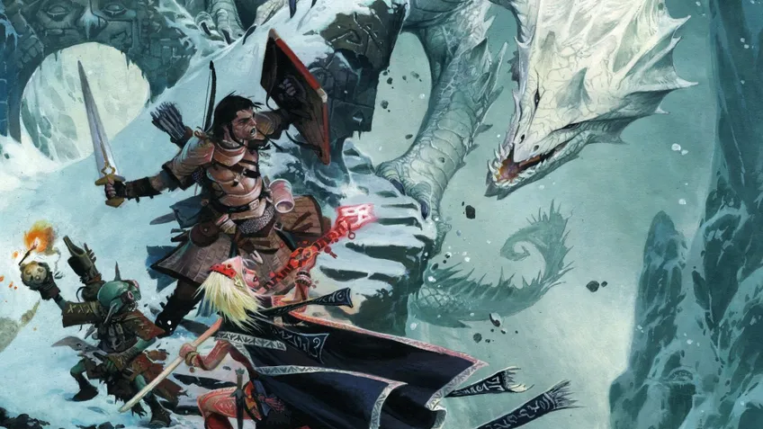

## Переклад PF2e

Привіт!

Найімовірніше, ти це читаєш уже тоді, коли перекладено основні правила, за винятком:
- Предметів
- Чар
- Умінь
- та іншого

__Проте хочу оголосити старт перекладу PF2e українською мовою!__

У планах перекласти все те, що міститься на Архівах Нефіса і не порушує ліцензій (архіви мають розширену ліцензію).

Насамперед перекладається __Player Core__.

Наступними за списком підуть:
- __Player Core 2__
- __GM Core__
- __Monster Core__

Після буде необхідно зробити вичитку, обговорити з ком'юніті спірні моменти і після продовжувати перекладати рулбуки, які не належать до лінійки Core.

[Переклад](https://rpgua.github.io/pf2e/)

[Чат у телеграмі (гілка PF2e)](https://t.me/+CkrhgLizpI8yMTgy)

__Щоб прийняти участь, прочитайте:__ _скоро_